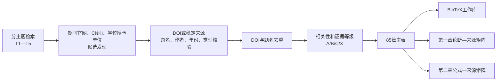
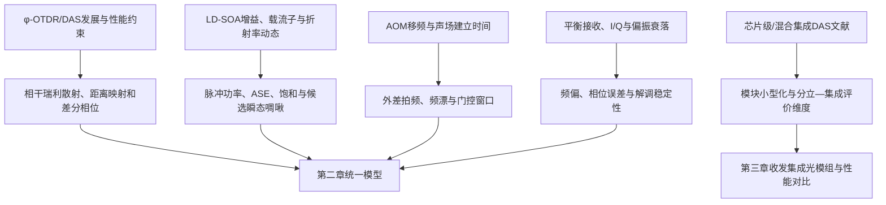

# 参考文献收集与结构审计报告

> 版本：2026-07-27（85篇更新版）  
> 状态：已达到85篇总量、中文文献补充和既定近年文献比例要求；正文定稿前仍需逐篇完成“论断—原文位置”复核  
> 用途：支撑第一章、第二章审阅稿及后续创新性核验

## 1. 当前结果

- 主表记录：85篇；
- BibTeX条目：85条；
- 唯一BibTeX键：85个，重复键0个；
- 有DOI条目：79篇，唯一DOI 79个，重复DOI 0个；
- 无DOI但具有可核验稳定来源：6篇（5篇学位论文、1篇中文期刊论文）；
- 中文文献：20篇；
- 中文学位论文：5篇，其中硕士论文4篇、博士论文1篇；
- 近年文献：55篇，占64.7%（沿用本课题既定口径，按2021年至检索日统计）；
- 新增10篇全部发表于2022—2025年，其中5篇学位论文、5篇中文期刊论文；
- 证据等级：A级66篇、B级17篇、C级2篇；
- 第一章草稿引用84篇，第二章草稿引用47篇，两章合计覆盖全部85篇。

主题分布：

| 主题 | 数量 | 主要用途 |
|---|---:|---|
| T1 φ-OTDR/DAS原理、演进与系统性能 | 28 | 第一章技术发展与工程应用；第二章传感原理 |
| T2 LD-SOA、增益动态、ASE与瞬态啁啾 | 9 | 第一章SOA研究现状；第二章器件机理 |
| T3 AOM移频、动态响应与同步 | 6 | 第一章时序与频漂问题；第二章AOM原理 |
| T4 相干接收、偏振衰落与数字解调 | 38 | 第一章接收解调现状；第二章信号模型 |
| T5 DAS小型化与光子集成 | 4 | 第一章集成趋势；第三章分立—集成对比的相邻证据 |

T5数量较少不是通过弱相关论文凑数。现有T5文献主要讨论芯片级或混合集成询问器；本文的收发集成光模组属于器件封装与光路模块级集成，两者只在“小型化、稳定性和工程化评价维度”上比较，不能写成同一种集成技术。

## 2. 本轮新增结构

新增5篇中文学位论文：

1. 冉玉娇，2025，桂林电子科技大学硕士论文；
2. 刘莹淮，2025，北京邮电大学硕士论文；
3. 黄森清，2025，中国科学技术大学工程硕士论文；
4. 田曼伶，2022，北京交通大学硕士论文；
5. 张令春，2023，合肥工业大学博士论文。

新增5篇近年中文期刊论文：

1. 孙文达等，2023，《激光与光电子学进展》；
2. 司召鹏等，2023，《中国激光》；
3. 刘念超等，2024，《红外与激光工程》；
4. 尚秋峰等，2024，《半导体光电》；
5. 张鸿等，2025，《光通信研究》。

每条新增记录的核验来源和稳定标识见`reference_addition_log.csv`。学位论文用于补充国内研究脉络、系统实现和工程应用证据；核心物理机理和可推广的性能判断仍优先由同行评议期刊论文支撑。

## 3. 文献发现与筛选流程

## 4. 论文问题与证据链

## 5. 使用边界

1. “可核验”表示题名、作者、年份、来源、卷期页码/文章号及DOI或稳定链接已经核对，不等于所有文献均已完成全文精读。
2. 第一章中的具体指标、优缺点和首创性判断，写入定稿前必须回到摘要或正文原始位置。
3. 学位论文适合支撑国内研究脉络与系统实现，不单独承担关键机理或“首次”论断。
4. SOA器件机理论文只能支撑可能的物理机制，不能替代SOA-DAS系统对照实验。
5. AOM脉冲选择、双AOM频漂抑制和同步论文提供相关证据；本文预补偿时序的效果仍需第三章实验。
6. 常规双偏振合成和经验参数调整写成“接收与解调优化”，不列为独立算法创新。

## 6. 引用覆盖结论

- 第一章已将新增学位论文放入“国内研究进展、系统实现与工程应用”论述；
- 第一、二章已将新增期刊论文分别用于DAS应用、FFT解调、事件识别和AOM频漂等论述；
- 两章合计引用全部85个BibTeX键，不存在只入库而未进入论证的条目；
- 详细语言、年份、学位类型、逐年分布和编译核验结果见`reference_language_year_audit.md`；
- 正式的`chapters/chap1.tex`和`bib/refs.bib`尚未覆盖，仍保留审阅流程。
